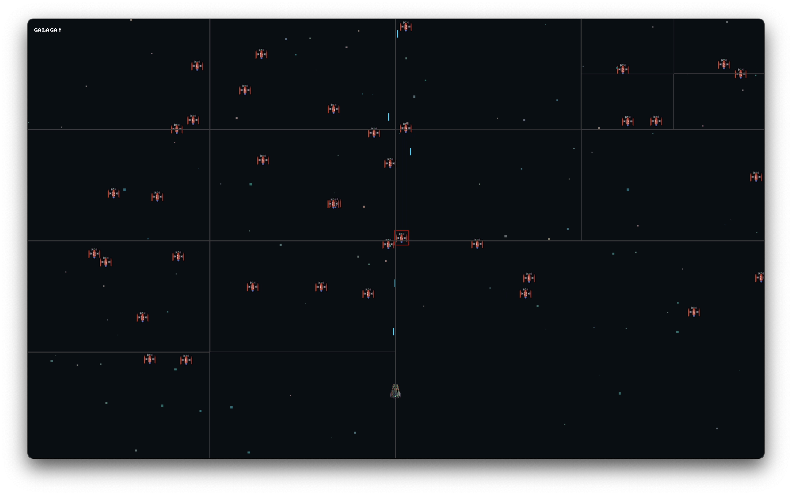

# Space Invaders Inspired Game in C (SDL)

Written using SDL in C. Utilizes Quad Tree collision detection. Hoping to implement some other fun algorithms additionally.

#### Screenshot of Quad Tree boundaries

Here you can see how the quad tree divides up the space and then the red hit box around an enemy that's just been hit. Notice how collisions work despite the enemy spanning multiple quadrants.


### TODO

- [x] Refactor bullet shooting method to not loop through entire bullet array.
- [x] Collision detection and actually giving damage to enemies when they're shot. _Implement something that is more efficient than O(N^2)_
  - [x] Build Quad Tree implementation. The tree needs to be able to handle values (enemies) that span multiple quadrants which adds a layer of complexity. (See `quadtree.c` for more TODOs)
    - [x] Add building functionality. (why was this so hard lol)
    - [x] Add querying functionality.
    - [x] Implement it into the actual game with live enemies. _Collision detection works!_
- [x] Split code into multiple files.
- [x] Add enemies to shoot at (probably multiple enemies). _This is like kinda there, we'll update more later once collisions are working_
- [ ] Implement health, possibly do a health bar or hearts?
- [ ] Level building and customization.
  - [x] Add basic level stuff.
  - [ ] Add a way to switch between or progress between levels. Like a manager or something.
  - [x] Add functions for spawning in enemy clusters in a less verbose way.
    - Good enough for now
- [ ] Start menu?
- [ ] Add animations for shooting and dying.
- [ ] Add a variety of enemies.
- [ ] Enemies might every once and a while do something other than move horizontally and shoot?

### Nice to haves

- [x] Better stars in the background that maybe move around a little when you move.
- [ ] Better or maybe even custom sprites.
- [ ] Make sure that my cpu utilization is at least okay.
- [ ] Add screenshots of gameplay (once there is gameplay).
- [x] Make Makefile actually look decent. (50% there, still some possible work in progress needed, but I'm marking this done for now)
- [x] Convert quad tree to be stack allocated or at least do research into whether or not that's a good idea.
  - Quad tree should be heap allocated. Sure, the stack would be faster, but due to the theoretical size of the quad tree heap allocation seems like a better choice.
- [ ] Ensure good and helpful comments throughout the code.
- [x] Standardize code style.
- [x] Pause game when unfocused.

### Notes

- Run this to format all code

  ```
  clang-format --style="{BasedOnStyle: LLVM, UseTab: Never, IndentWidth: 4, TabWidth: 4}" -i src/*.c src/*.h
  ```

- Do **not** typedef structs or enums for this codebase.
- Assets procured from [here](https://foozlecc.itch.io/void-fleet-pack-2)
- Yes, I know a Quad Tree was definitely not required for this to run smoothly. But it's a good learning opportunity so why not.
